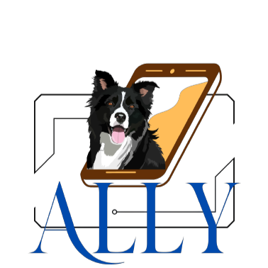

# Ally

  Projeto de aplicativo mobile em desenvolvimento pelos alunos da Etec Dra. Ruth Cardoso.

   
  
  
  

:small_blue_diamond: [Descrição do projeto](#descrição-do-projeto)
:small_blue_diamond: [Protótipo](#prototipo)
:small_blue_diamond: [Linguagens, dependencias e libs utilizadas](#linguagens)
:small_blue_diamond: [Desenvolvedores](#desenvolvedores)

## Descrição do projeto 

   
 O projeto o qual nossa equipe está desenvolvendo é direcionado para uma empresa de assessoria canina, a Brothers, a qual fornece serviços de dog walker, hotelaria, banho e tosa e agility. Tivemos a ideia de desenvolver para essa empresa um aplicativo, que a princípio (para o desenvolvimento do TCC), servirá para automatizar o agendamento do serviço de hotelaria e possibilitar os clientes fazerem um gerenciamento de seus animais por meio de um aplicativo, bem como ter acesso a novidades e informações sobre a empresa, como horários de funcionamento e promoções. Posteriormente a entrega do TCC temos a ideia de ampliar para todos os outros serviços, podendo ser um aplicativo a ser entregue para a empresa. 

- Funções técnicas do Aplicativo:  
Dentro do aplicativo terá uma seção inicial onde os clientes terão acesso as informações da empresa, como horário de funcionamento, telefone, localização, tipos de serviço que empresa oferece, etc. Além disso terá também uma opção de cadastro e login, onde quando registrado e efetuado o login o usuário terá acesso ao gerenciamento de seus animais, podendo cadastrar ou remover, e também acesso ao agendamento do serviço, ficando disponível um calendário o qual o usuário poderá consultar as datas e horários disponíveis e realizar a solicitação.

- Lista de funcionalidades:  
• Registro de clientes  
• Registro do animal  
• Login/Logout  
• Visualização de disponibilidade (exibir calendário)  
• Agendamento do hotel  
• Observação (preferências, restrições ou serviços adicionais)  
• Avaliação e comentários  
• Cancelamento e alteração de agendamento  
• Informações para contato  
• Localização do hotel  
• Feed de notícias

|- Diagrama de caso de uso:|- Diagrama de classes|
|:---: |:---: 
|||

<a id="prototipo">
  
  ## Protótipo do projeto :iphone:
</a>

O prototipo do projeto foi desenvolvido no Figma, tendo como destaque as seguintes telas: 
|Tela Principal|Login| Cadastro| Perfil| Adição de Pet|Agendar Serviço|
|:---:|:---: |:---: |:---: |:---: |:---:
||||||

a visualização com as devidas funcionalidades de botões encontra-se no seguinte link do figma: 
- ?type=design&scaling=scale-down&page-id=0%3A1&node-id=6-172&starting-point-node-id=6%3A172)

<a id="linguagens">
  
  ##  Linguagens, dependencias e libs utilizadas :books:
</a>

- [React Native](https://reactnative.dev/docs/getting-started)
- [MySql](https://www.mysql.com)

<a id="desenvolvedores">
  
  ##   Desenvolvedores :octocat:
</a>

| [ Aniara Zwarg](https://github.com/aniarazwarg) |  [ Eduardo Elias](https://github.com/Eduardo-112) |  [ Luca Barata](https://github.com/lucabarata) |[ Luis Felipe](https://github.com/devluisfpaixao) |[ Yan Barboza](https://github.com/YanBarboza) |
| :---: | :---: | :---: | :---: | :---: 
|Gerenciamento do Repositório;  Documentação de Normas e regulamentos;  Definiçao de Requisitos ;  Design e funções de protótipo; | Design de gráficos;  Controle e documentação de atividades semanais da equipe;|Formatação de documentação técnica;  Documentação de pesquisa de mercado;  Regras de negócio;  Funçoes de prototipo; | Documentação de viabilidade;  Documentação de dados;  Adição de Requisitos;|Documentação de Pertinência;  Entrevista com o gestor;  Diagramas de caso e classes;|

### Métodos de Desenvolvimento
Todos os integrantes do grupo tem autonomia em realizar suas adiçoes de código e de scripts do banco no projeto, e isso vem sido desenvolvido em conjunto durante as aulas, mas tambem individualmente de acordo com o tempo disponível de cada integrante, Neste momento os integrantes desenvolvem as telas do projeto, para que posteriormente prossigamos com a integração ao banco de dados que já foi desenvolvido pela equipe durante o período de elaboração da documentação técnica e definição das funçoes do software. 

- Estilo de Codificação 

Cada função é identificada com o nome que vai de acordo à sua usabilidade, tal como:  

- Estilo de identação 

|A cada View mantemos uma linha de Espaço|Para os Estilos não há linha extra de espaço|
|:---: |:---: 
|||

- Comentários 
Cada Imagem e função é identificada com comentarios: 

  
 
